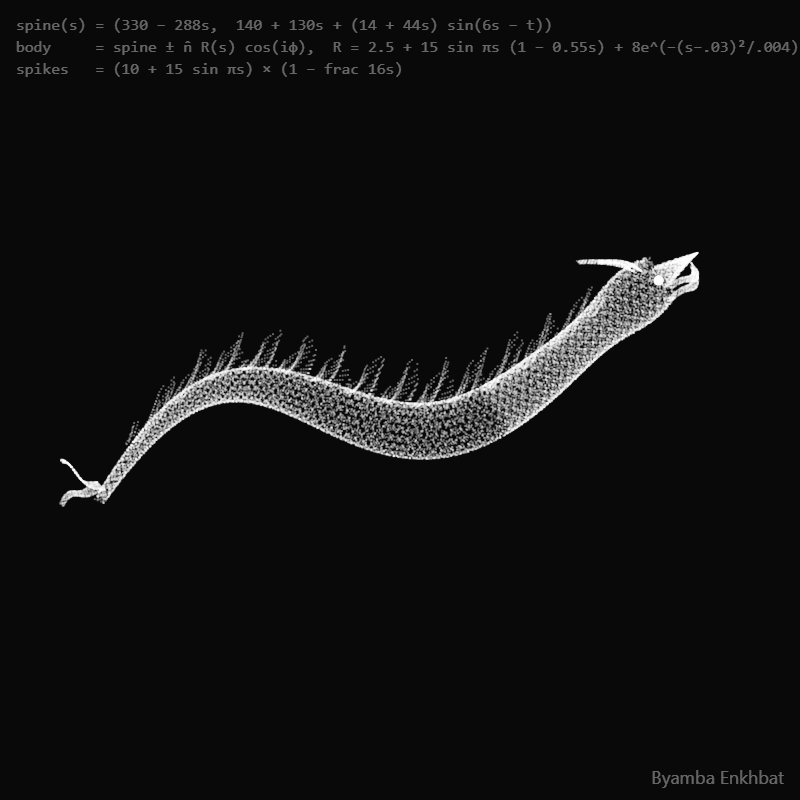
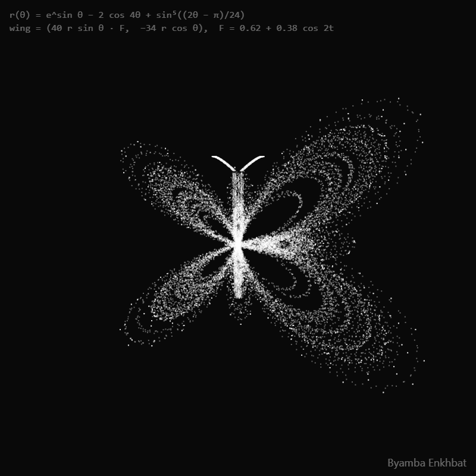

# mathbeasts 🐉

> Creatures made of **20,000 dots and a few lines of trig** — with a live
> playground to bend the math, and a renderer that turns any beast into a
> pixel-perfect looping GIF.

<p align="center">
  
</p>

Every animal here is *one function*, evaluated 20,000 times per frame. No
textures, no meshes, no physics engine — each particle `i` flows through a
couple of trig fields and lands as a single faint white pixel. Overlap builds
the glow. Time `t` is the only thing that moves.

```js
// the entire dragon body, more or less:
spine(s) = (330 − 288s,  140 + 130s + (14 + 44s)·sin(6s − t))
body     = spine ± n̂ · R(s)·cos(iφ)          // φ = golden angle
```

## The beasts

| 🐉 dragon | 🪼 jellyfish | 🦋 butterfly |
|:---:|:---:|:---:|
|  |  |  |
| traveling-wave spine, ribbed tube body, sawtooth spikes | breathing bell, scalloped frill, nine swaying tentacles | Temple Fay curve wings, flapping on `cos 2t` |

Each one is a single self-contained sketch in [`scenes/`](scenes) — ~40 lines
of plain JavaScript, no dependencies. The full field equations are typeset in
**[MATH.md](MATH.md)**.

## Try it in 10 seconds — no install

```
git clone https://github.com/byambaa1982/mathbeasts
```

Open **`player.html`** in any browser. That's it — no build, no server, no
dependencies. Then:

- **Pick a beast** from the dropdown.
- **Drag the speed slider** (0.25×–8×) and the fps slider — on-screen motion
  is `dt × speed × fps`, so both change how the creature moves.
- **Edit the code** in the panel and hit `Ctrl+Enter`. Every number is a
  parameter:

| change this | to get |
|---|---|
| `t += PI/40` (the `dt`) | slower / faster time itself |
| `i = 2e4` | more / fewer particles (density vs speed) |
| `stroke(w, 96)` | brighter or ghostlier dots (alpha 0–255) |
| the trig coefficients | a *different animal* — this is the fun part |
| `WATERMARK = '...'` | your signature in the corner (`''` to disable) |
| `FORMULA = [...]` | the tiny math annotation in the top-left |

Break it freely — `Restart` reloads the scene's original code.

## Render a perfectly-looping GIF

```bash
pip install -r tools/requirements.txt
python -m playwright install chromium

python tools/render_canvas_gif.py --html scenes/dragon.html --fps 12
```

Most GIF capture drifts, because it screenshots in real time. This renderer
doesn't: the engine exposes a deterministic `__seek()` stepper, so frame *n*
is always exactly frame *n* — and the loop closes with **zero seam** because
the frame count is derived from the sketch's actual math period.

Renderer knobs: `--fps` (playback speed), `--size 400x400`, `--scale 2`
(supersampling), `--frames` (override the scene's `loop()` value),
`--max-colors` (GIF palette / file size).

## Why the loop never skips

Everything animates through `sin(… + a·t)` terms, so the sketch repeats after

$$T = \frac{2\pi}{\gcd(a_1, a_2, \ldots)}$$

Divide by `dt` to get the period in draw-steps; each scene ends with
`loop(FRAMES, STEP)` where `FRAMES × STEP = T / dt`. Keep every `t`
coefficient an integer or power of ½ and the period stays short. All three
beasts use `dt = π/40` with coefficients in `{1, 2}` → exactly **80 frames
per loop**. Derivations in [MATH.md](MATH.md).

## Make your own beast

The recipe (long version in [MATH.md](MATH.md#design-recipe)):

1. **Skeleton first** — one parametric curve (a spine, a rim, a wing
   outline); every feature is an offset from it.
2. **Roles by residue** — `i % 8 < 6` body, `== 6` fins, `== 7` details.
3. **One clock** — a traveling wave `sin(ks − t)` for motion, a breath
   `sin t` for life. Integer coefficients keep the loop at 80 frames.
4. **Golden-angle sampling + 1–2px jitter** — that's what makes dots read
   as organic glow instead of CAD lines.

Save it as `scenes/mybeast.js` ending in `loop(FRAMES, STEP)`, copy any
`.html` wrapper next to it, run `python tools/build_player_sources.py`, and
it appears in the playground. Working with Claude Code? The repo ships a
[`/new-beast`](.claude/commands/new-beast.md) workflow that designs the loop
math and iterates the render until it passes.

The engine ([`engine.js`](engine.js), ~100 lines) is a deliberately tiny
p5.js-style shim: `createCanvas / background / stroke / strokeWeight / point`
plus the math globals. If a sketch needs `noise()` or HSB color, extend it.

## License

MIT — see [LICENSE](LICENSE). The beasts you make with it are yours.
