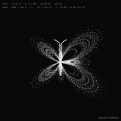
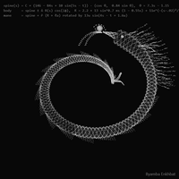
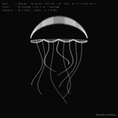
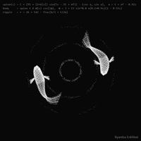

# mathbeasts 

> Creatures made of **20,000 dots and a few lines of trig** — with a live
> playground to bend the math, and a renderer that turns any beast into a
> pixel-perfect looping GIF.

<p align="center">
  <b>▶ Play with it right now — <a href="https://mathbeasts.vercel.app">mathbeasts.vercel.app</a></b><br>
  <sub>no install, no build — edit the math in your browser and watch the beast change</sub>
</p>

<p align="center">
  <a href="scenes/butterfly.gif"></a>
</p>

Every animal here is *one function*, evaluated 20,000 times per frame. No
textures, no meshes, no physics engine — each particle `i` flows through a
couple of trig fields and lands as a single faint white pixel. Overlap builds
the glow. Time `t` is the only thing that moves.

```js
// the entire dragon body, more or less:
spine(s) = C + (146 − 84s + 10·sin(5s − t)) · (cos θ, 0.84·sin θ),  θ = 7.3s − 1.15
body     = spine ± n̂ · R(s)·cos(iφ)          // φ = golden angle
```

## The beasts

| 🐉 dragon | 🪼 jellyfish | 🦋 butterfly | 🐟 koi |
|:---:|:---:|:---:|:---:|
| [](scenes/dragon.gif) | [](scenes/jellyfish.gif) | [](scenes/butterfly.gif) | [](scenes/koi.gif) |
| coiled spiral chasing a flaming pearl — mane, antler horns, whiskers | breathing bell, scalloped frill, nine swaying tentacles | Temple Fay curve wings, flapping on `cos 2t` | two koi circling like a yin-yang, ripples spreading beneath |

*(click any beast for the full-resolution GIF)*

Each one is a single self-contained sketch in [`scenes/`](scenes) — ~40 lines
of plain JavaScript, no dependencies. The full field equations are typeset in
**[MATH.md](MATH.md)**.

## Try it in 2 seconds

Open **[mathbeasts.vercel.app](https://mathbeasts.vercel.app)** — the full
playground runs in your browser. Or run it locally (it's just static files):

```
git clone https://github.com/byambaa1982/mathbeasts
```

Open **`player.html`** in any browser. That's it — no build, no server, no
dependencies. Then:

- **Pick a beast** from the chips under the stage.
- **Drag the speed slider** (0.25×–8×) and the fps slider — on-screen motion
  is `dt × speed × fps`, so both change how the creature moves.
- **Edit the code** in the panel and hit `Ctrl+Enter`. Every number is a
  parameter:

| change this | to get |
|---|---|
| `t += PI/40` (the `dt`) | slower / faster time itself |
| `i = 2e4` | more / fewer particles (density vs speed) |
| `stroke(w, 96)` | brighter or ghostlier dots (alpha 0–255) |
| the trig coefficients | a *different animal* — this is the fun part |
| `WATERMARK = '...'` | your signature in the corner (`''` to disable) |
| `FORMULA = [...]` | the tiny math annotation in the top-left |

Break it freely — `Restart` reloads the scene's original code. Two more
buttons worth knowing:

- **🎲 Mutate** nudges a few random coefficients by ±20% and re-runs —
  accidental new species guaranteed (`Restart` undoes).
- **🌐 Hero page** downloads a ready-to-ship landing page that uses the
  beast's looping GIF as its hero image — attention-grabbing motion that
  autoplays everywhere from a single `` tag, no video player, no JS.

## Render a perfectly-looping GIF

```bash
pip install -r tools/requirements.txt
python -m playwright install chromium

python tools/render_canvas_gif.py --html scenes/dragon.html --fps 12
```

Most GIF capture drifts, because it screenshots in real time. This renderer
doesn't: the engine exposes a deterministic `__seek()` stepper, so frame *n*
is always exactly frame *n* — and the loop closes with **zero seam** because
the frame count is derived from the sketch's actual math period.

Renderer knobs: `--fps` (playback speed), `--size 400x400`, `--scale 2`
(supersampling), `--frames` (override the scene's `loop()` value),
`--max-colors` (GIF palette / file size).

## Why the loop never skips

Everything animates through `sin(… + a·t)` terms, so the sketch repeats after

$$T = \frac{2\pi}{\gcd(a_1, a_2, \ldots)}$$

Divide by `dt` to get the period in draw-steps; each scene ends with
`loop(FRAMES, STEP)` where `FRAMES × STEP = T / dt`. Keep every `t`
coefficient an integer or power of ½ and the period stays short. All four
beasts use `dt = π/40` with coefficients in `{1, 2}` → exactly **80 frames
per loop**. Derivations in [MATH.md](MATH.md).

## Make your own beast

The recipe (long version in [MATH.md](MATH.md#design-recipe)):

1. **Skeleton first** — one parametric curve (a spine, a rim, a wing
   outline); every feature is an offset from it.
2. **Roles by residue** — `i % 8 < 6` body, `== 6` fins, `== 7` details.
3. **One clock** — a traveling wave `sin(ks − t)` for motion, a breath
   `sin t` for life. Integer coefficients keep the loop at 80 frames.
4. **Golden-angle sampling + 1–2px jitter** — that's what makes dots read
   as organic glow instead of CAD lines.

Save it as `scenes/mybeast.js` ending in `loop(FRAMES, STEP)`, copy any
`.html` wrapper next to it, run `python tools/build_player_sources.py`, and
it appears in the playground. (In pull requests you can skip the rendering —
a GitHub Action re-renders every GIF and rebuilds the player sources when a
scene changes.)

The engine ([`engine.js`](engine.js), ~100 lines) is a deliberately tiny
p5.js-style shim: `createCanvas / background / stroke / strokeWeight / point`
plus the math globals. If a sketch needs `noise()` or HSB color, extend it.

## Share your beast

Two ways, by increasing permanence:

- **Send a link** — hit **🔗 Share** in the
  [playground](https://mathbeasts.vercel.app): your edited code is packed
  into the URL itself, so anyone who opens the link sees *your* beast running
  live. No fork, no account, no server.
- **Join the gallery** — open a PR adding `scenes/<beast>.js` (+ a copy of
  any `.html` wrapper). If it's an original creature that follows the recipe
  above and loops seamlessly, it gets merged into the playground and listed
  here with credit. CI renders the GIF for you.

### Community gallery

*Nothing here yet — the first merged beast starts it. PRs welcome.*

## License

MIT — see [LICENSE](LICENSE). The beasts you make with it are yours.
